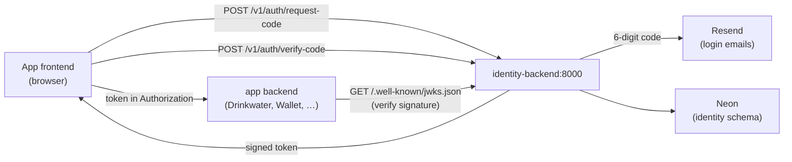

# Ducktivity Identity Service

Identity is the suite's **central account + token service**. It is deliberately the
**only** service that signs session tokens. Apps (Drinkwater, Wallet, …) never sign —
they verify the tokens identity mints by fetching its public key from the JWKS
endpoint. That asymmetry is the whole point: **one issuer, many verifiers**, and no
signing secret spread across apps.

It owns three things:

| Piece                | Role                                                                                                      |
| -------------------- | --------------------------------------------------------------------------------------------------------- |
| **Accounts + login** | Passwordless email login: request a 6-digit code, exchange it for a signed token.                         |
| **Token issuance**   | Signs Ed25519 session tokens and publishes the public key at `/.well-known/jwks.json` for apps to verify. |
| **Entitlement**      | Stamps the suite-wide entitlement into the token — one payment unlocks every app, no per-app Stripe call. |

## How it works



1. A frontend POSTs to `/v1/auth/request-code`; identity emails (or, in dev, logs) a 6-digit code.
2. The frontend POSTs the code to `/v1/auth/verify-code`; identity returns a signed token carrying the account's current suite-wide entitlement.
3. App backends verify that token's signature against the public key from `/.well-known/jwks.json` — they never talk to identity per-request, and never hold the signing key.

## Endpoints

| Route                        | What                                                        |
| ---------------------------- | ----------------------------------------------------------- |
| `POST /v1/auth/request-code` | Email a login code.                                         |
| `POST /v1/auth/verify-code`  | Exchange a code for a signed token.                         |
| `POST /v1/billing/webhook`   | Stripe subscription events → suite-wide entitlement (stub). |
| `POST /v1/dev/grant`         | Dev-only: flip entitlement without Stripe.                  |
| `GET /.well-known/jwks.json` | Public key set apps fetch to verify tokens.                 |
| `GET /healthz` `/readyz`     | Liveness / readiness probes.                                |

## Running it locally

The backend runs with live reload via [air](https://github.com/air-verse/air),
pinned as a Go tool (no global install needed):

```bash
cd backend
go tool air
```

It rebuilds and restarts on save (config in [backend/.air.toml](backend/.air.toml),
build output in `backend/tmp/`) and serves on `http://localhost:8000`.

**Config.** Air reads `backend/.env` for local config. At minimum set `DATABASE_URL`
(identity's tables live in the `identity` schema). Leave the secrets empty in dev:

- `AUTH_SIGNING_KEY` empty → an ephemeral signing key is generated per run.
- `RESEND_API_KEY` empty → login codes are **logged** instead of emailed.
- `AUTH_CODE_PEPPER` empty → falls back to an insecure dev default.
- `SENTRY_DSN` empty → Sentry is a no-op.

`.env` is not needed for local development. See [backend/docs.dev.md](backend/docs.dev.md) for migrations, SQL codegen, and the check gate.

## Deploying it

Deploy is **two phases**: CI builds and migrates automatically on merge; going live is
a deliberate manual step. Expand-only migrations keep the old container working against
the new schema, so there's no rush between the two.

**Phase 1 — push to `main` (automatic).** When anything under `backend/` changes,
[Backend CD](.github/workflows/cd-backend.yml) re-verifies the commit, runs the
expand-only goose migration straight at Neon, and — only if that succeeds — builds the
image and pushes it to GHCR tagged `latest` and `sha-<gitsha>`. **CI stops here.** It
holds no SSH access to the box and never flips the live service.

**Phase 2 — go live (manual).** From your machine, reconcile the box to a specific tag:

```bash
./deploy/remote-deploy.sh sha-1a2b3c4      # or: latest
```

It copies `docker-compose.yml` and your local `.env.prod` (landed on the box as `.env`)
over Cloudflare Access SSH, then on the box pulls the tag, runs `compose up`, gates on
`/readyz`, and **auto-rolls-back** to the last good tag if the new one never reports
ready. No secrets ever touch git or GitHub — they live only in `identity/.env.prod` on
your disk.

Prereqs:

- [ ] `cloudflared` installed.
- [ ] Cloudflare Access service token sourced (`TUNNEL_SERVICE_TOKEN_ID` / `TUNNEL_SERVICE_TOKEN_SECRET`).
- [ ] `identity/.env.prod` filled in (copy from [.env.example](.env.example)).
- [ ] The shared [edge stack](../edge/README.md) is up — it owns the `ducktivity_edge` network this app attaches to.

## Files

| File                 | What                                                                 |
| -------------------- | -------------------------------------------------------------------- |
| `backend/`           | The Go service (`go tool air` to run).                               |
| `docker-compose.yml` | The `app` service; attaches to the shared `ducktivity_edge` network. |
| `.env.example`       | Box runtime env template. Copy to `.env.prod` and fill it in.        |

Ingress (the shared `cloudflared`) and log shipping (the shared `vector`) both live in
the [edge stack](../edge/README.md) — this app just attaches to `ducktivity_edge` as
`identity-backend` and carries the `collect_logs` label.
