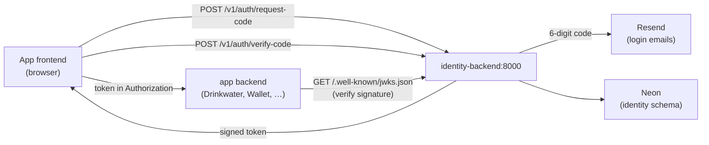

# Ducktivity Identity Service

Identity is the suite's **central account + token service**. It is deliberately the
**only** service that signs session tokens. Apps (Drinkwater, Wallet, …) never sign —
they verify the tokens identity mints by fetching its public key from the JWKS
endpoint. That asymmetry is the whole point: **one issuer, many verifiers**, and no
signing secret spread across apps.

It owns three things:

| Piece                | Role                                                                                                      |
| -------------------- | --------------------------------------------------------------------------------------------------------- |
| **Accounts + login** | Passwordless email login: request a 6-digit code, exchange it for a signed token.                         |
| **Token issuance**   | Signs Ed25519 session tokens and publishes the public key at `/.well-known/jwks.json` for apps to verify. |
| **Entitlement**      | Stamps the suite-wide entitlement into the token — one payment unlocks every app, no per-app Stripe call. |

## How it works



1. A frontend POSTs to `/v1/auth/request-code`; identity emails (or, in dev, logs) a 6-digit code.
2. The frontend POSTs the code to `/v1/auth/verify-code`; identity returns a signed token carrying the account's current suite-wide entitlement.
3. App backends verify that token's signature against the public key from `/.well-known/jwks.json` — they never talk to identity per-request, and never hold the signing key.

## Endpoints

| Route                        | What                                                        |
| ---------------------------- | ----------------------------------------------------------- |
| `POST /v1/auth/request-code` | Email a login code.                                         |
| `POST /v1/auth/verify-code`  | Exchange a code for a signed token.                         |
| `POST /v1/billing/webhook`   | Stripe subscription events → suite-wide entitlement (stub). |
| `POST /v1/dev/grant`         | Dev-only: flip entitlement without Stripe.                  |
| `GET /.well-known/jwks.json` | Public key set apps fetch to verify tokens.                 |
| `GET /healthz` `/readyz`     | Liveness / readiness probes.                                |

## Running it locally

The backend runs with live reload via [air](https://github.com/air-verse/air),
pinned as a Go tool (no global install needed):

```bash
cd backend
go tool air
```

It rebuilds and restarts on save (config in [backend/.air.toml](backend/.air.toml),
build output in `backend/tmp/`) and serves on `http://localhost:8000`.

**Config.** Air reads `backend/.env` for local config. At minimum set `DATABASE_URL`
(identity's tables live in the `identity` schema). Leave the secrets empty in dev:

- `AUTH_SIGNING_KEY` empty → an ephemeral signing key is generated per run.
- `RESEND_API_KEY` empty → login codes are **logged** instead of emailed.
- `AUTH_CODE_PEPPER` empty → falls back to an insecure dev default.
- `SENTRY_DSN` empty → Sentry is a no-op.

`.env` is not needed for local development. See [backend/docs.dev.md](backend/docs.dev.md) for migrations, SQL codegen, and the check gate.

## Deploying it

Deploy is **push-based**: merging to `main` builds, migrates, and goes live in one
automatic run. Expand-only migrations keep the old container working against the new
schema during the brief cutover. Full runbook: [deploy/README.md](deploy/README.md).

**On push to `main`** touching `backend/` or `deploy/`,
[Backend CD](.github/workflows/cd-backend.yml) re-verifies the commit, runs the
expand-only goose migration straight at Neon, builds and pushes the image to GHCR
(`latest` + `sha-<gitsha>`), then SSHes to the box over Cloudflare Access (short-lived
cert from a service token — no standing key, no open port 22) and runs
[`deploy/deploy.sh`](deploy/deploy.sh) `<sha>`. That checks out the commit, sops-decrypts
`.env`, brings the stack up at the matching `sha-<gitsha>`, gates on `/readyz`, and
**auto-rolls-back** on the box if it never reports ready. A failed deploy turns the
Actions run red — that's the only alert.

**Secrets** are committed, SOPS-encrypted, as [deploy/.env.sops](deploy/.env.sops) —
values encrypted, keys readable. The box decrypts on the fly with its age key; the
plaintext `.env.prod` never leaves your disk. Edit them with
`./deploy/secrets.sh edit`, then commit `.env.sops` and push.

**Roll back** (image revert only) to any past commit from your machine:

```bash
./deploy/remote-deploy.sh <full-git-sha>
```

**Publishing the API client (manual, for now).** The `@ducktivity/identity-client` npm
package is **not** shipped by CI — [API Client CD](.github/workflows/cd-api-client.yml)
is intentionally disabled (commented out) so we publish by hand while the contract is
still churning. When you've changed the API and want to cut a client release:

```bash
cd api-client
pnpm run generate-types        # regenerate src/schema.d.ts from shared-schemas/swagger.json

# bump "version" in package.json, then:
pnpm run build                 # tsc build into dist/
npm publish --access public    # needs "npm login" for the @ducktivity org
```

Prereqs:

- [ ] `sops` + `age` installed, and box secrets encrypted: copy [deploy/.env.example](deploy/.env.example) to `deploy/.env.prod`, then `./deploy/secrets.sh encrypt` and commit `deploy/.env.sops`.
- [ ] For manual rollback (`remote-deploy.sh`): `cloudflared` installed and an Access service token sourced (`TUNNEL_SERVICE_TOKEN_ID` / `TUNNEL_SERVICE_TOKEN_SECRET`).
- [ ] The shared [edge stack](../edge/README.md) is up — it owns the `ducktivity_edge` network this app attaches to.

See [deploy/README.md](deploy/README.md) for the full one-time box + key setup.

## Files

| File                        | What                                                                       |
| --------------------------- | -------------------------------------------------------------------------- |
| `backend/`                  | The Go service (`go tool air` to run).                                     |
| `deploy/`                   | The push-based SOPS deploy stack — see [deploy/README.md](deploy/README.md). |
| `deploy/docker-compose.yml` | The `app` service; attaches to the shared `ducktivity_edge` network.       |
| `deploy/.env.example`       | Box runtime env template. Copy to `deploy/.env.prod` and fill it in.       |

Ingress (the shared `cloudflared`) and log shipping (the shared `vector`) both live in
the [edge stack](../edge/README.md) — this app just attaches to `ducktivity_edge` as
`identity-backend` and carries the `collect_logs` label.
